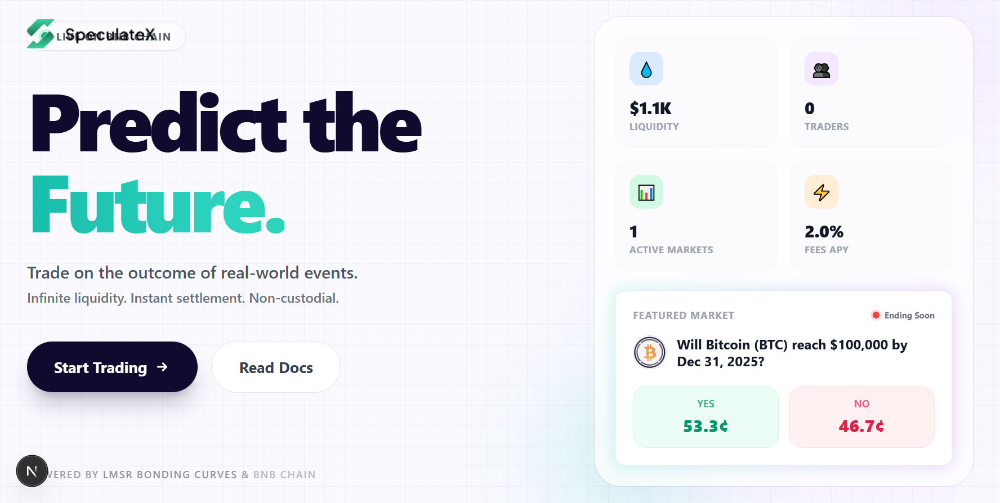
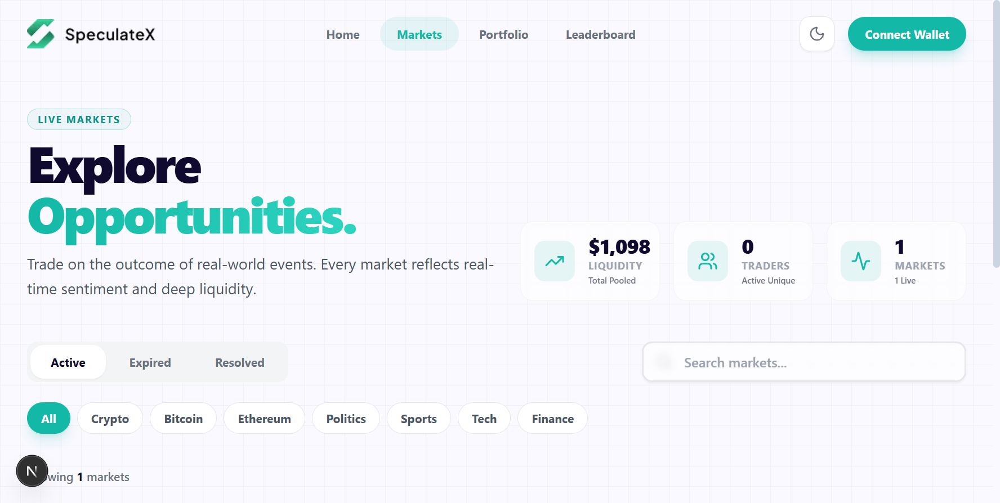
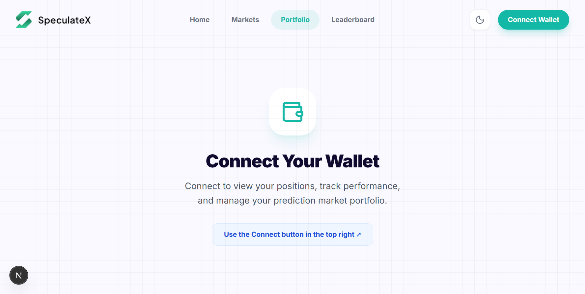
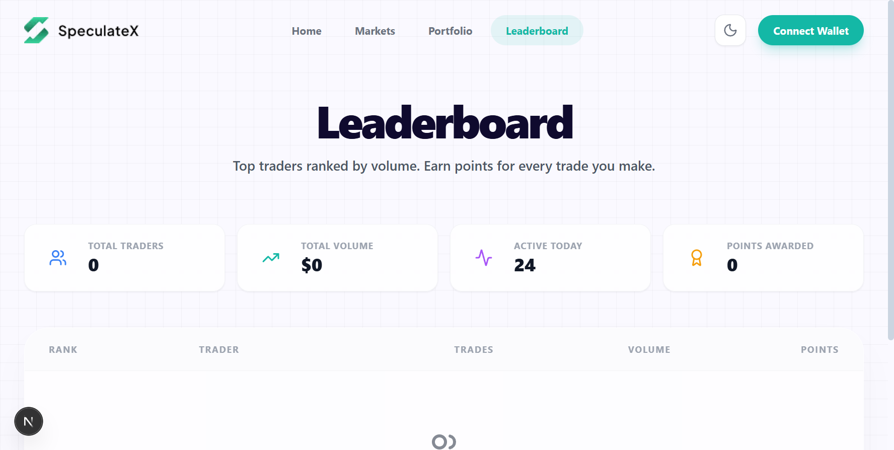

# SpeculateX Protocol

<div align="center">



**Decentralized, Automated Prediction Markets on BNB Chain**

[](https://opensource.org/licenses/MIT)
[](https://soliditylang.org/)
[](https://bscscan.com/)
[](https://testnet.bscscan.com/)
[](https://getfoundry.sh/)

[🚀 Live Demo](http://localhost:3003) • [📚 Documentation](./docs) • [💬 Discord](https://discord.gg/speculatex) • [🐦 Twitter](https://twitter.com/speculatex)

</div>

-----

## 📖 Overview

**SpeculateX** is a decentralized prediction market protocol that allows users to trade on real-world events (crypto prices, sports, economics). Unlike traditional order-book exchanges, SpeculateX uses an **Automated Market Maker (AMM)** based on **LMSR** to ensure constant liquidity and continuous pricing.

The protocol features a "Be The Market" architecture where users can provide liquidity to specific markets and earn trading fees, alongside a robust **Chainlink Automation** system for trustless market resolution.

**Status:** Mainnet is deployed (legacy monolith). Current development focus is Testnet (Diamond Router + Facets).

-----

## ⚙️ Core Architecture

<div align="center">



*Explore active markets with real-time statistics*

</div>

The protocol consists of several modular smart contracts:

### 1. 🧠 Core (Engine)

The central hub of the protocol.

- **BSC Mainnet** uses the legacy **monolithic** `SpeculateCore`.
- **BSC Testnet** uses a **Diamond-style** architecture: `SpeculateCoreRouter` + Facets (`MarketFacet`, `TradingFacet`, `LiquidityFacet`, `SettlementFacet`).

### 2. 🧮 LMSRMath.sol (The Logic)

A specialized math library implementing the Logarithmic Market Scoring Rule.

- **Pricing:** Calculates spot prices and trade costs using high-precision fixed-point arithmetic (18 decimals).
- **Cost Function:** `C(q) = b * ln(exp(qYes/b) + exp(qNo/b))`.
- **Liquidity Parameter (b):** Dynamically adjusts based on the total liquidity in the pool.

### 3. 🤖 ChainlinkResolver.sol (The Oracle)

Ensures trustless and automated settlement.

- **Resolution:** Fetches Chainlink Aggregator price at expiry and calls the core settlement function.
- **Validation:** Checks for staleness and answer validity.
- **Data Feeds:** Fetches real-time price data (e.g., BTC/USD) from Chainlink Aggregators.

### 4. 💰 Financial Primitives

- **PositionToken.sol:** ERC20 tokens representing outcome shares (YES/NO), minted only by the Core.
- **Treasury.sol:** Collects protocol fees.
- **MockUSDC.sol:** A testnet-only stablecoin with a faucet for development.

-----

## 🚀 Key Features

<div align="center">


*Browse and filter active prediction markets*

</div>

### "Be The Market" (Liquidity Provision)

Users can fund markets via `addLiquidity`.

- **No Impermanent Loss logic:** LPs own a share of the pool's "b" parameter.
- **Rewards:** LPs earn a configurable fee (default 1%) on every trade, tracked via an accumulator index (`accFeePerUSDCE18`).
- **Residual Claims:** Post-resolution, LPs claim remaining vault funds proportional to their share.

### Dynamic Fee Structure

Fees are calculated in Basis Points (BPS) and split three ways:

1. **Treasury:** Protocol sustainability.
2. **LP:** Rewards for liquidity providers.
3. **Vault:** Reinvested into the market to deepen liquidity.

### Safety Guardrails

- **Max Price Jump:** Prevents manipulation by limiting how much a single trade can move the price (Default: 15%).
- **Staleness Checks:** Markets won't resolve if Oracle data is older than 1 hour.
- **Admin Timelock:** Router upgrades/admin actions are timelocked on production-like deployments (Testnet script uses timelock=0 for convenience).

### Multi-Network Support

- **BSC Mainnet:** Production deployment with real USDC
- **BSC Testnet:** Development and testing with MockUSDC faucet
- **Network Selector:** Easy switching between Mainnet and Testnet in the UI

-----

## 🛠 Deployment

<div align="center">


*Trade YES/NO positions with instant execution*

</div>

### 🌐 BSC Mainnet (Chain ID: 56)

| Contract | Address | Explorer |
|----------|---------|----------|
| **SpeculateCore** | `0xDCdAf5219c7Cb8aB83475A4562e2c6Eb7B2a3725` | [View on BscScan](https://bscscan.com/address/0xDCdAf5219c7Cb8aB83475A4562e2c6Eb7B2a3725) |
| **ChainlinkResolver** | `0x93793866F3AB07a34cb89C6751167f0EBaCf0ce3` | [View on BscScan](https://bscscan.com/address/0x93793866F3AB07a34cb89C6751167f0EBaCf0ce3) |
| **Treasury** | `0x5ca1b0EFE9Eb303606ddec5EA6e931Fe57A08778` | [View on BscScan](https://bscscan.com/address/0x5ca1b0EFE9Eb303606ddec5EA6e931Fe57A08778) |
| **USDC** | `0x8AC76a51cc950d9822D68b83fE1Ad97B32Cd580d` | [View on BscScan](https://bscscan.com/address/0x8AC76a51cc950d9822D68b83fE1Ad97B32Cd580d) |
| **Admin** | `0x4dc74a8532550ffca11fb958549ca0b72e3f1f1c` | [View on BscScan](https://bscscan.com/address/0x4dc74a8532550ffca11fb958549ca0b72e3f1f1c) |

### 🧪 BSC Testnet (Chain ID: 97)

| Contract | Address | Explorer |
|----------|---------|----------|
| **SpeculateCoreRouter** | `0x601c5DA28dacc049481eD853E5b59b9F20Dd44a8` | [View on BscScan](https://testnet.bscscan.com/address/0x601c5DA28dacc049481eD853E5b59b9F20Dd44a8) |
| **ChainlinkResolver** | `0x18cA980383C16ee6C601a7a110D048e12e95e9F5` | [View on BscScan](https://testnet.bscscan.com/address/0x18cA980383C16ee6C601a7a110D048e12e95e9F5) |
| **Treasury** | `0x155FB12aD27259212f000443531fAe8a629F2A19` | [View on BscScan](https://testnet.bscscan.com/address/0x155FB12aD27259212f000443531fAe8a629F2A19) |
| **MockUSDC (faucet)** | `0x845740D345ECba415534df44C580ebb3A2432719` | [View on BscScan](https://testnet.bscscan.com/address/0x845740D345ECba415534df44C580ebb3A2432719) |
| **Admin** | *(deployer wallet)* | `vm.addr(PRIVATE_KEY)` |

### Testnet Facets (Diamond)

| Facet | Address | Explorer |
|------|---------|----------|
| **MarketFacet** | `0x12886B7d5C5Ebb15B29F70e3De1c90A359a74B93` | [View](https://testnet.bscscan.com/address/0x12886B7d5C5Ebb15B29F70e3De1c90A359a74B93) |
| **TradingFacet** | `0xe9521eA09C960780fe58bf625CA2b94D60E37a70` | [View](https://testnet.bscscan.com/address/0xe9521eA09C960780fe58bf625CA2b94D60E37a70) |
| **LiquidityFacet** | `0xe975a09183a61Cdb1f7279265B75da6EEB24e6A4` | [View](https://testnet.bscscan.com/address/0xe975a09183a61Cdb1f7279265B75da6EEB24e6A4) |
| **SettlementFacet** | `0x88A7F6DdeA0BCD7998d78331313E6fb8504039c1` | [View](https://testnet.bscscan.com/address/0x88A7F6DdeA0BCD7998d78331313E6fb8504039c1) |

**Important (Testnet):** the deploy script uses **timelock=0** (testnet convenience), so facets + resolver are executed immediately. For production-like staging, increase the timelock and execute ops after the delay.

**Market titles without subgraph:** questions are stored on-chain and read via `getMarketQuestion(uint256)` (no dependency on the subgraph for titles).

**📋 Full Address List:** See [CONTRACT_ADDRESSES.md](./CONTRACT_ADDRESSES.md) and [DEPLOYED_ADDRESSES.md](./DEPLOYED_ADDRESSES.md).

-----

## 🎨 Platform Screenshots

<div align="center">

### Portfolio & Leaderboard

 | 
:---: | :---:
*Track your positions and performance* | *Compete with top traders*

</div>

-----

## 💻 Developer Guide

### Prerequisites

- [Foundry](https://getfoundry.sh/)
- [Node.js](https://nodejs.org/) (v18+)
- [npm](https://www.npmjs.com/) or [yarn](https://yarnpkg.com/)

### Installation

```bash
git clone https://github.com/speculatedotfun/SpeculateX.git
cd speculatev1

# Install contract dependencies
cd contracts
forge install

# Install frontend dependencies
cd ../frontend
npm install
```

### Configuration

#### Contracts

Create a `.env` file in the `contracts` directory:

```env
# Required
PRIVATE_KEY=your_deployer_private_key
BSC_TESTNET_RPC_URL=https://bsc-testnet.publicnode.com
BSC_MAINNET_RPC_URL=https://bsc-dataseed.binance.org
BSCSCAN_API_KEY=your_bscscan_api_key

# Optional (for scripts)
USDC_ADDRESS=0x8AC76a51cc950d9822D68b83fE1Ad97B32Cd580d
SPECULATE_CORE_ADDRESS=0xDCdAf5219c7Cb8aB83475A4562e2c6Eb7B2a3725
CHAINLINK_RESOLVER_ADDRESS=0x93793866F3AB07a34cb89C6751167f0EBaCf0ce3
TREASURY_ADDRESS=0x5ca1b0EFE9Eb303606ddec5EA6e931Fe57A08778
```

#### Frontend

Create a `.env.local` file in the `frontend` directory:

```env
# Required
NEXT_PUBLIC_WALLETCONNECT_PROJECT_ID=your_walletconnect_project_id

# Optional (defaults provided)
NEXT_PUBLIC_RPC_URL=https://bsc-testnet.publicnode.com
NEXT_PUBLIC_MAINNET_RPC_URL=https://bsc-dataseed.binance.org
NEXT_PUBLIC_GOLDSKY_HTTP_URL=your_goldsky_subgraph_url
```

**📝 Full Setup Guide:** See [ENV_SETUP.md](./ENV_SETUP.md) for detailed instructions.

### Build & Test

#### Contracts

```bash
cd contracts

# Compile contracts
forge build

# Run unit tests
forge test

# Run specific test with traces
forge test --match-contract SpeculateCoreTest -vvvv

# Check test coverage (qualitative assessment: 95%+)
forge coverage
```

#### Frontend

```bash
cd frontend

# Development server
npm run dev

# Production build
npm run build

# Start production server
npm start
```

### Deployment

#### Testnet

```bash
cd contracts
forge script script/deploy.sol:DeployAndSchedule \
  --rpc-url bsc_testnet \
  --broadcast \
  --legacy \
  --gas-price 1000000000
```

#### Mainnet

Mainnet deployment docs are in `contracts/MAINNET_DEPLOYMENT.md` (legacy monolith).

**⚠️ Important:** Before deploying to Mainnet:
1. Verify all Chainlink feed addresses
2. Ensure you have sufficient BNB for gas
3. Use a dedicated deployment wallet
4. Transfer ownership to a multisig after deployment

**📋 Full Deployment Guide:** See [MAINNET_DEPLOYMENT.md](./contracts/MAINNET_DEPLOYMENT.md) for complete instructions.

-----

## 📜 Interaction Guide

### 1. Creating a Market

Call `createMarket` (Diamond/Testnet: via Router → `MarketFacet`):

```solidity
createMarket(
    "Will BTC hit 100k?",  // question
    "BTC100K YES",         // yesName
    "BTC100K-YES",         // yesSymbol
    "BTC100K NO",          // noName
    "BTC100K-NO",          // noSymbol
    1000 * 1e6,            // initUsdc (6 decimals)
    expiryTimestamp,       // unix timestamp
    oracleFeed,            // Chainlink feed address (or address(0) for OracleType.None)
    priceFeedId,           // bytes32 (optional metadata)
    targetValue,           // scaled to feed decimals
    Comparison.Above       // 0=Above, 1=Below, 2=Equals
)
```

### 2. Trading

Call `buy` to purchase positions:

```solidity
// Buy YES tokens with 50 USDC
core.buy(marketId, true, 50 * 1e6, minTokensOut);
```

### 3. Resolution (Automated)

Resolution is triggered by calling the resolver after expiry:

1. Anyone (or an off-chain bot/automation) calls `ChainlinkResolver.resolve(marketId)` after `expiryTimestamp`.
2. The resolver reads the Chainlink feed, enforces staleness + decimals guardrails, then calls `resolveMarketWithPrice(marketId, price)` on the core.
3. The market is marked resolved and trading stops.

-----

## 🧪 Testing

The protocol includes comprehensive test coverage:

- **Unit Tests:** All core functionality tested
- **Fuzz Tests:** Randomized input testing
- **Invariant Tests:** System-wide property verification
- **Coverage:** 95%+ code coverage (qualitative assessment)

Run tests:

```bash
cd contracts
forge test -vvv
```

-----

## 📚 Documentation

- [Contract Addresses](./CONTRACT_ADDRESSES.md) - Complete address list for all networks
- [Deployed Addresses](./DEPLOYED_ADDRESSES.md) - Production deployment addresses
- [Environment Setup](./ENV_SETUP.md) - Detailed environment variable guide
- [Mainnet Deployment](./contracts/MAINNET_DEPLOYMENT.md) - Mainnet deployment guide
- [Chainlink Automation Setup](./contracts/CHAINLINK_AUTOMATION_SETUP.md) - Chainlink setup guide

-----

## 🔗 Links

- **BscScan Mainnet**: `https://bscscan.com/`
- **BscScan Testnet**: `https://testnet.bscscan.com/`
- **Chainlink Price Feeds**: `https://docs.chain.link/data-feeds/price-feeds/addresses?network=bnb-chain`
- **WalletConnect Cloud**: `https://cloud.reown.com/`

-----

## 📄 License

This project is licensed under the **MIT License**.

-----

**Disclaimer:** This is production software deployed on BSC Mainnet. Use real funds at your own risk. Prediction markets involve risk. Trade responsibly.
